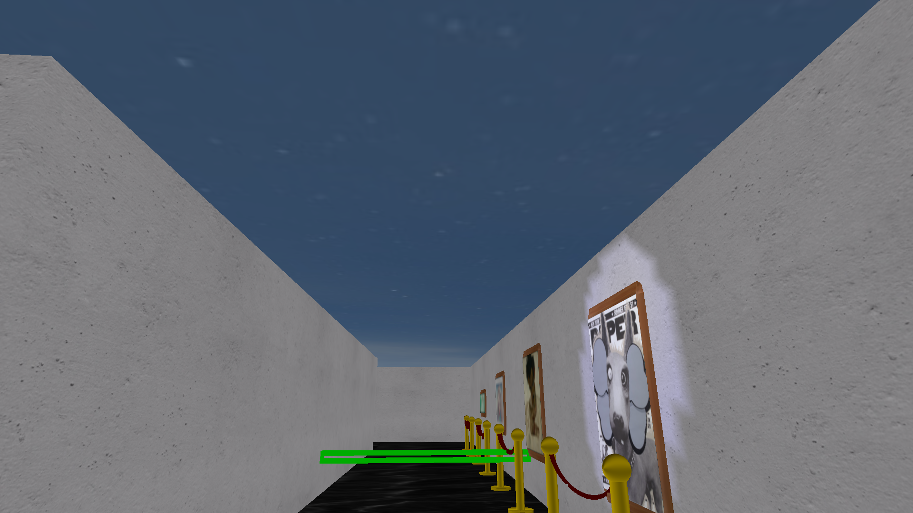
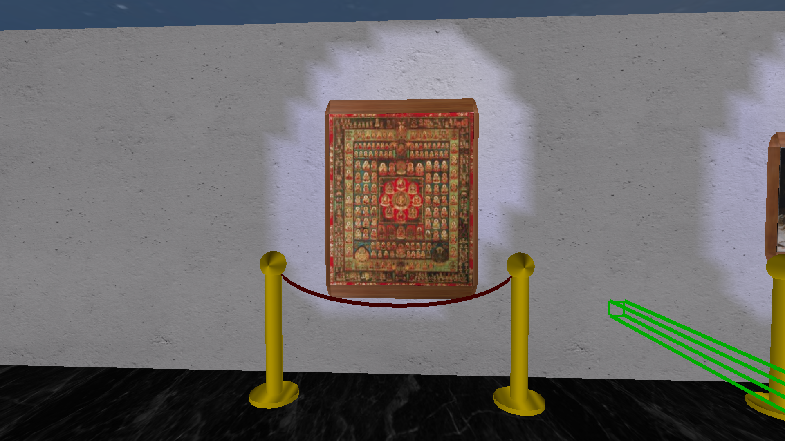

# 🏛️ Simulador de Museu em C++ com OpenGL

## 📖 Sobre o Projeto

Este projeto é um **simulador de museu 3D** desenvolvido em **C++** utilizando a biblioteca **OpenGL**. O museu é construído na forma de um ciclo em que a exposição das artes se altera de acordo com o deslocamento do jogador.

---

## 🔧 Instalação do Gerenciador de Pacotes (Meson)

# Ubuntu/Debian:

```bash
sudo apt update
sudo apt install meson ninja-build libcurl4-openssl-dev
```

# Fedora/RHEL/CentOS:

```bash
sudo dnf install meson ninja-build libcurl-devel
```

# macOS (via Homebrew):

```bash
brew install meson ninja
```

## 📦 Instalação das Dependências (libcurl)

# Ubuntu/Debian:

```bash
sudo apt update
sudo apt install libcurl4-openssl-dev
```

# Fedora/RHEL/CentOS:

```bash
sudo dnf install libcurl-devel
```

# macOS (via Homebrew):

```bash
brew install curl
```

# Fallback do Meson para _libcurl_

Caso encontre dificuldades para instalar a biblioteca _libcurl_ através do gerenciador de pacotes do seu sistema operacional, utilize o Meson como solução alternativa. Dessa forma, siga para a próxima instrução.

## ⚙️ Como Compilar e Executar

Certifique-se de ter o **Meson** e o **Ninja** instalados.

Para o setup das bibliotecas do projeto rode:

```bash
meson setup build
```

Para compilar e rodar o projeto, use:

```bash
meson compile -C build && ./build/main
```

## Conceitos utilizados no desenvolvimento do projeto:

- Conceito de oclusão foi utilizado para a renderização do céu aberto do museu, em que o _Z-BUFFER_ é inicialmente desativado e depois reativado para dar a impressão de profundidade no céu;
  
- Para a iluminação do ambiente foi utilizada uma luz direcional vinda do "céu", e três luzes do tipo spotlight que são revezadas para iluminar os quadros próximos ao jogador;
- Texturas foram aplicadas tanto no ambiente (céu, parede, chão, barreira e etc) quanto para renderizar as artes nas molduras;
- Para modelar a corda da barreira que fica a frente das artes no museu, utilizou-se uma curva de bézier.
   Exemplo de arte renderizada utilizando textura, iluminação de spotlight e curva de bézier para a barreira

## Problemas encontrados

- Dificuldade na renderização correta das artes, o carregamento das texturas se apresentava com distorção, falta de cores, de cabeça para baixo e etc;
- Dificuldade no posicionamento e direcionamento das luzes, devido a normal das superficies rotacionadas e a posição variável dos quadros;
- Necessidade de uma lógica e estrutura de dados para iluminar apenas os quadros proximos ao jogador, devido ao número limitado de luzes;
- Implementação da colisão com as paredes do museu, visto que a sua construção é em forma de um ciclo.

## O que pode ser melhorado

- Deixar o carregamento das artes dinâmico, sem necessidade de armazenamento local, puxando todas as imagens de uma API;
- Implementar colisão com os objetos do museu, encapsulando os objetos utilizando a estrutura de dados bounding volume;

## Contribuição de cada integrante

O projeto foi completamente implementado com todos os membros da equipe presentes, em que os mesmos foram revezando a escrita do código enquanto os outros dois membros auxiliavam na construção das lógicas.
